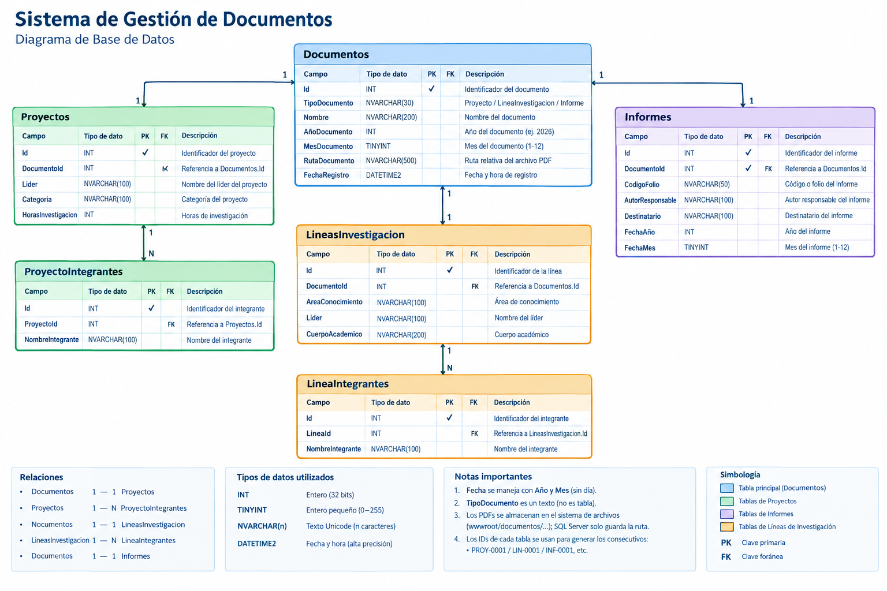

# Sistema de Gestion de Proyectos Academicos
Repositorio oficial de el Departamento de Posgrado e Investigación y Subdirección de Posgrado e Investigación para la gestión y respaldo de el sistema que será entregado posteriormente a los administradores

## Cronograma de Actividades

| Periodo                                  | Actividades                                                                                                                                                                                                                                                                                                        |
| ---------------------------------------- | ------------------------------------------------------------------------------------------------------------------------------------------------------------------------------------------------------------------------------------------------------------------------------------------------------------------ |
| **1er Bimestre** 01/06/2026 - 03/08/2026 | - Levantamiento de requerimientos del departamento. - Análisis del problema actual de organización documental. - Diseño de la estructura del sistema. - Diseño de base de datos. - Diseño de interfaz inicial. - Configuración del entorno de desarrollo (ASP.NET MVC y SQL Server).                |
| **2do Bimestre** 04/08/2026 - 05/10/2026 | - Desarrollo del módulo de inicio de sesión. - Desarrollo del módulo de registro de proyectos. - Implementación de subida y almacenamiento de archivos PDF. - Desarrollo del buscador de proyectos. - Desarrollo de funciones de edición y eliminación. - Integración con base de datos SQL Server. |
| **3er Bimestre** 06/10/2026 - 02/12/2026 | - Pruebas del sistema en red local. - Corrección de errores y optimización. - Implementación en equipo servidor del departamento. - Capacitación básica al personal administrativo. - Elaboración de documentación técnica y manual de usuario. - Entrega final del sistema.                        |

## Tabla de Actividades:

| No. | Actividad                                          | Periodicidad |
| --- | -------------------------------------------------- | ------------ |
| 1   | Levantamiento de requerimientos                    | Única vez    |
| 2   | Análisis del problema actual                       | Única vez    |
| 3   | Diseño de estructura del sistema                   | Única vez    |
| 4   | Diseño de base de datos                            | Única vez    |
| 5   | Diseño de interfaz inicial                         | Semanal      |
| 6   | Configuración del entorno ASP.NET MVC y SQL Server | Única vez    |
| 7   | Desarrollo del módulo de inicio de sesión          | Diaria       |
| 8   | Desarrollo del módulo de registro de proyectos     | Diaria       |
| 9   | Implementación de subida de PDFs                   | Diaria       |
| 10  | Desarrollo del buscador                            | Diaria       |
| 11  | Funciones de edición y eliminación                 | Diaria       |
| 12  | Integración con SQL Server                         | Semanal      |
| 13  | Pruebas del sistema                                | Semanal      |
| 14  | Corrección de errores y optimización               | Diaria       |
| 15  | Implementación en equipo servidor                  | Única vez    |
| 16  | Capacitación al personal                           | Única vez    |
| 17  | Elaboración de documentación                       | Semanal      |
| 18  | Entrega final del sistema                          | Única vez    |

## Diagrama relacional de base de datos

